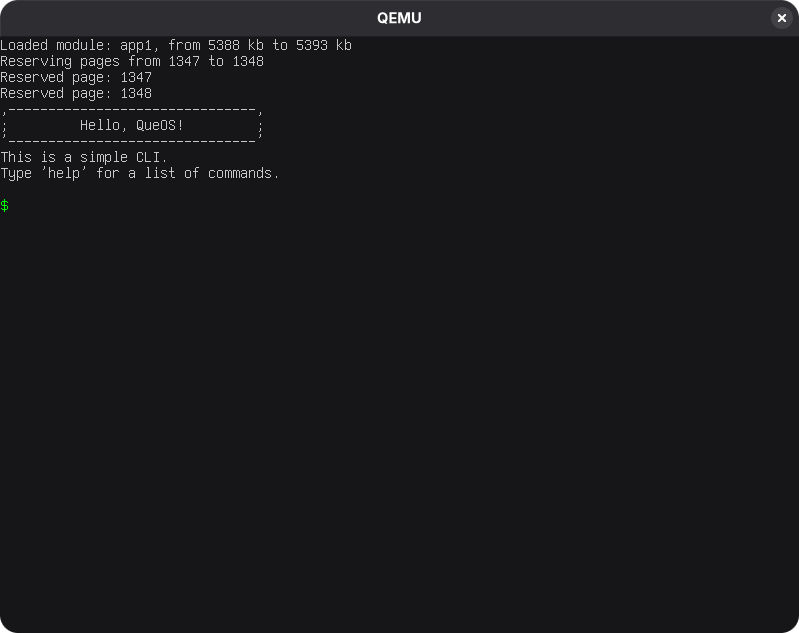
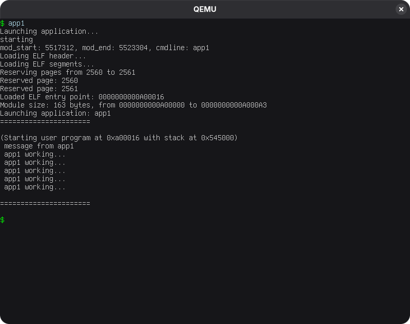

<p align="center">
  
</p>


QueOS is a hobby operating system project written in C and x86 assembly. It is made for educational purposes and experimentation with low-level OS concepts.
 
## Features
- 32-bit protected mode kernel
- Multiboot2 booting via GRUB2
- Basic memory management (physical)
- Simple CLI (command-line interface)
- Keyboard and display drivers
- Interrupt and IRQ handling
- Paging and basic process/user mode support 


## Screenshots

<p align="center">
  
  
</p>


## Build Instructions
### Prerequisites
- A Linux environment 
- Cross Compiler `gcc` (GNU Compiler Collection)
- `nasm` (Netwide Assembler)
- `make` (Build automation tool)
- `qemu` (Emulator for running the OS)
- `grub2` (Bootloader)

### Building the OS
1. Clone the repository:
   ```bash
   git clone https://github.com/alfaiajanon/QueOS.git
   cd QueOS
   ```

2. Change the value of `PREFIX` in the Makefile and `includePath` in c_cpp_properties.json to the directory of your cross-compiler tools

3. Build the OS using `make`:
   ```bash
   make
   ```
4. (For debugging)
   ```bash
   make debug
   ```


## License
This project is licensed under the MIT License.  
See the [LICENSE](LICENSE) file for details.